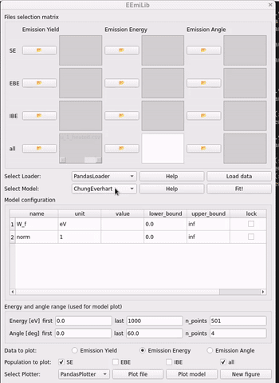

# EEmiLib

**EEmiLib** (Electron EMIssion Library) provides several electron emission
models and a simple interface to fit them to experimental data. It includes
both a _graphical user interface_ (GUI) for ease of use and a **Python API**
for advanced users.

The library focuses on electron emission models relevant to multipactor
simulations, _i.e._ for impinging energies ranging from a few eV to several
hundred eV.

This project is still under active development.
I maintain it in my free time, but I'll do my best to answer any questions you
may have.

## Features

- Multiple electron emission models
- Graphical interface for quick model fitting
- Python API for scripting and automation

## Installation

### For users

1. Create a dedicated Python environment.
2. Run

```bash
pip install EEmiLib
```

> [!NOTE]
> If you are completely new to Python and these instructions are unclear, check
> [this tutorial](https://python-guide.readthedocs.io/en/latest/).
> In particular, you will want to:
>
> 1. [Install Python](https://python-guide.readthedocs.io/en/latest/starting/installation/)
>    3.12 or higher.
> 2. [Learn to use Python environments](https://python-guide.readthedocs.io/en/latest/dev/virtualenvs/)
>    , `pipenv` or `virtualenv`.
> 3. Optionally, [install a Python IDE](https://python-guide.readthedocs.io/en/latest/dev/env/#ides)
>    such as Spyder or VSCode.

### For developers

If you want to edit the source code:

1. Clone the repository: `git clone git@github.com:AdrienPlacais/EEmiLib.git`
2. Create a dedicated Python environment.
3. From EEmiLib folder: `pip install -e .[test]`
4. Test that everything is working with `pytest -m "not implementation"`.

> [!WARNING] If you `Download ZIP` this repository (which can happen if you
> don't have access to `git`), installation will fail at step #3.
> [A workaround](https://lightwin.readthedocs.io/en/latest/manual/troubles/setuptools_error.html)
> is proposed here. This is a different library, but the same method applies.

## Usage

### Graphical User Interface

To start the GUI, run following command in a bash:

```bash
eemilib-gui
```

A `Module not found error` generally means that the EEmiLib Python environment
is not activated.



### Python API

A typical script would look like:

```python
import numpy as np
from eemilib.emission_data import DataMatrix
from eemilib.loader import PandasLoader
from eemilib.model import Vaughan
from eemilib.plotter import PandasPlotter

data_matrix = DataMatrix()
data_matrix.set_files(
    filepath="path/to/a/TEEY/file.csv",
    population="all",
    data_type="Emission Yield",
)

loader = PandasLoader()
data_matrix.load_data(loader)

model = Vaughan()
model.find_optimal_parameters(data_matrix)

plotter = PandasPlotter()
axes = data_matrix.plot(
    plotter=plotter, population="all", data_type="Emission Yield"
)
model.plot(
    plotter=plotter,
    population="all",
    data_type="Emission Yield",
    energies=np.linspace(0, 1000, 1001),
    angles=np.linspace(0, 60, 4),
    axes=axes,
)
```

Complete examples are available in [the
documentation](https://eemilib.readthedocs.io/en/latest/auto_examples/index.html).

## Roadmap/To-Do

- [x] Document abbreviations
- GUI:
  - [ ] Better handling of multiple `Plot data` and `Plot model` buttons push.
    - [ ] Let user choose `group_by_pe` and `e_pes` for `"Emission Energy"`
          plots.
  - [x] Display quantitative criteria to assess model quality (e.g., Nicolas
        Fil's criterion)
  - [x] Display derived quantities such as crossover energies, maximum TEEY,
        etc.
  - [ ] Let user load and plot files that are not needed for current `Model`, so
        they can compare `Model` data with tabulated data easily.
- CI:
  - [x] `PyPI` release.
  - [x] Update installation instructions.
  - [ ] Allow execution on online Docker ?
- [ ] `Export` buttons
  - [ ] Tabulated model data.
  - [ ] Model parameters value (makes sense along with an `Import` button).
- [ ] Fix error when not running from a git repo:

  ```bash
  fatal: not a git repository (or any parent up to mount point /)
  Stopping at filesystem boundary (GIT_DISCOVERY_ACROSS_FILESYSTEM not set).`
  ```

- API:
  - [x] `Model.display_parameters()` method for nice printing.
  - [ ] Import/export model configuration with a `TOML`.
  - [ ] Make `Model` store its data in a `DataMatrix`?
  - [ ] Should every `Model` be fitted on `all` population?
- If it proves useful:
  - [ ] Handle experimental data with error bars
  - [ ] Add control over interpolation of loaded experimental data
  - [ ] Optional smoothing of measured data
  - [x] Different line styles/colors for different populations.
  - [ ] Ready-to-use interface for PIC codes.
