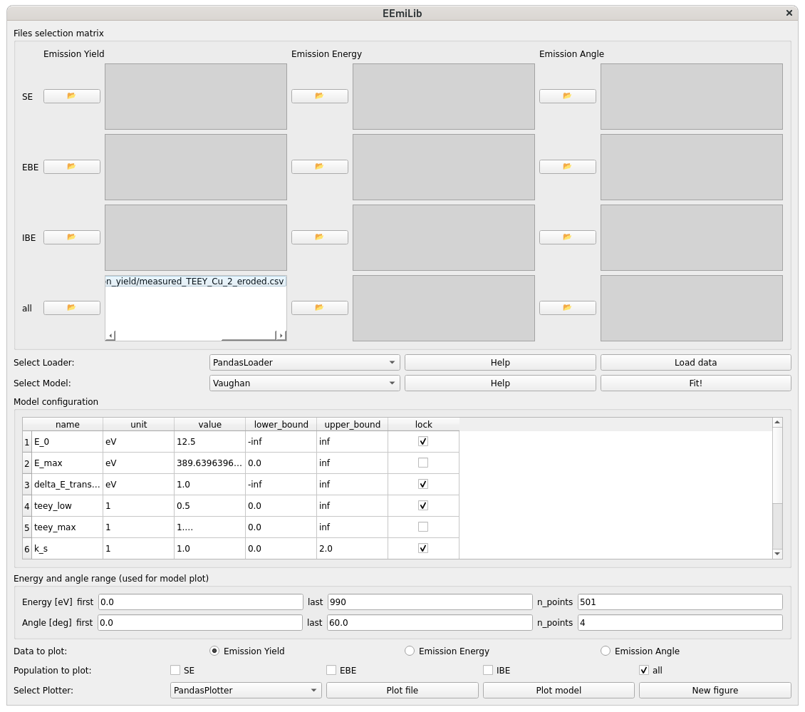
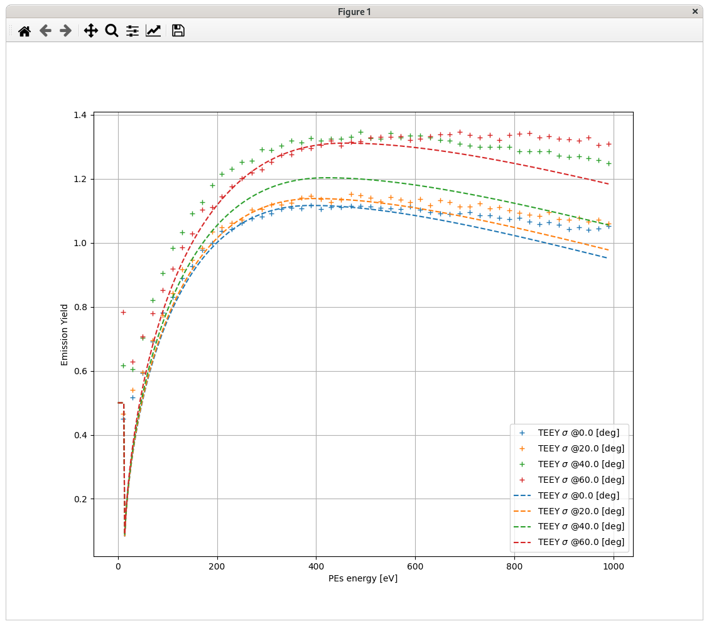

.. _quick-start-link:

Quick start
***********

.. toctree::
   :maxdepth: 4
   :hidden:

Run the `gui.py` script located in `src/eemilib/gui/`.
If you installed EEmiLib using pip, you can also run the following command: `eemilib-gui`.
The following window should open.

Load the experimental data
==========================

1. Select your data :class:`.Loader`.

 - The choice of the loader depends on the format of your data file.
   By default, use :class:`.PandasLoader`.
   It will work with the example data provided in `data/example_copper`.

2. Select your electron emission :class:`.Model`.

 - Changing the model updates the `Files selection matrix`, according to the experimental files required by the model.
 - Changing the model also updates the list of parameters in `Model configuration`.

3. Select the file(s) to be loaded in the `Files selection matrix`.
4. Load the data by clicking `Load data`.
5. Plot the loaded data to check that it is properly understood.
 a. Select emission data type to plot: Emission Yield, Emission Energy Distribution or Emission Angle Distribution.
 b. Select populations to plot: SEs, EBEs, IBEs, or all electrons.
 c. Click `Plot file`.

Fit the model on the data
=========================

6. Click `Fit!` to fit the model on the data.

 - It should update the values of the model parameters in `Model configuration`.
 - You can manually modify those values.
 - You can `lock` a parameter to a specific value and rerun the `Fit!`.

7. Plot the modelled data with `Plot model`.

 - You can change the ranges of plotted energies and angles using `PEs energy and angle range (model plot)`.

